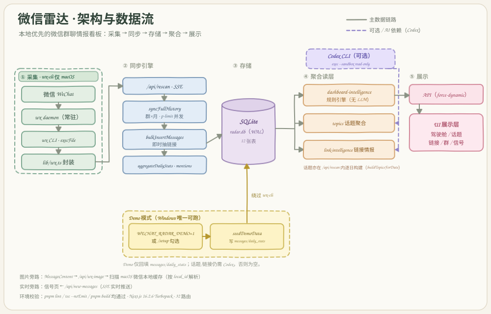

# 微信雷达 · 项目路线图（Roadmap）

> 本地优先的微信群聊情报看板。文档聚焦「现状盘点 + 分阶段迭代规划」，供后续按优先级逐项落地。

## 1. 项目简介

微信雷达（WeChat Radar）是一款本地优先（local-first）的微信群聊情报看板。它通过 macOS 端的 `wx-cli` 采集本机微信群聊历史，汇入本地 SQLite（`~/.wechat-radar/radar.db`），再经同步引擎、规则聚合与可选的 Codex CLI 智能处理，最终在驾驶舱、话题雷达、链接情报、群管理与实时信号等页面呈现「值得处理的高信号」。全程只读、数据默认不出本机，仅在启用 Codex 或链接抓取时才会有内容离开本地。

## 2. 技术栈

| 类别 | 选型 |
| --- | --- |
| 框架 | Next.js 16.2.6（App Router）+ React 19.2.4 |
| 语言 | TypeScript ^5（strict） |
| 包管理 | pnpm（`pnpm-lock.yaml` 锁定，`node_modules/` 即隔离环境） |
| 数据存储 | better-sqlite3 ^12.10.0（原生模块，WAL 模式） |
| 图表 | echarts ^6.1.0 + echarts-for-react |
| 校验 | zod ^4.4.3 |
| 缓存 / 并发 | node-cache ^5.1.2、p-limit ^7.3.0 |
| 样式 | Tailwind CSS v4 + CSS 变量主题 |
| 图标 | lucide-react |
| 外部 CLI | `wx`（wx-cli，仅 macOS）、`codex`（Codex CLI，可选） |
| 未使用依赖 | next-themes（已安装但未使用，主题为 `components/ThemeToggle.tsx` 手写实现） |

脚本：`dev` / `build` / `start` / `lint` / `test` / `test:watch` / `db:backup` / `demo:seed`。已接入 vitest（见第 11 节 N2）。

## 3. 目录结构

```text
weahat_radar/
├── app/                      # Next.js App Router
│   ├── layout.tsx            # 根布局（lang=zh-CN）
│   ├── page.tsx              # 驾驶舱首页（客户端组件，fetch /api/stats）
│   ├── globals.css           # Tailwind v4 + CSS 变量主题
│   ├── setup/                # 初始化配置页
│   ├── topics/               # 话题雷达
│   ├── links/                # 链接情报
│   ├── mentions/             # @我的
│   ├── classify/             # 群分类建议
│   ├── signals/              # 实时信号（SSE）
│   ├── groups/               # 群管理（含 [id] 详情）
│   ├── reports/groups/[id]/  # 群报告
│   └── api/                  # 22 个 route.ts（见第 5 节）
├── lib/                      # 业务逻辑（无 React 依赖，易测）
│   ├── wx.ts                 # wx-cli 封装
│   ├── wx-types.ts           # wx-cli 输出类型
│   ├── wx-image.ts           # 微信本地图片解析（macOS 路径硬编码）
│   ├── db.ts                 # better-sqlite3 单例 + 迁移 + seed
│   ├── messages-store.ts     # 消息批量入库 + 日聚合 + sync_state
│   ├── config.ts             # DATA_DIR / 配置合并 / configured 判定
│   ├── cache.ts              # NodeCache 单例 + key 工厂
│   ├── topics.ts             # 话题聚合（Codex CLI）
│   ├── link-intelligence.ts  # 链接情报（Codex + 网页抓取 + 双层缓存）
│   ├── message-links.ts      # 纯本地链接抽取/规范化
│   ├── dashboard-intelligence.ts # 驾驶舱情报引擎（纯规则）
│   ├── stats-aggregator.ts   # 同步引擎（群×月并发）
│   ├── mentions.ts           # @我的（子串匹配 + 增量失效）
│   ├── groups.ts             # 分组/标签/收藏 CRUD
│   ├── group-classifier.ts   # 群名启发式分类
│   ├── range.ts              # 日期/范围纯函数工具
│   └── demo-data.ts          # 注入 demo 数据
├── components/               # 11 个 React 组件（见第 4 节末）
├── scripts/                  # backfill_empty_groups.cjs / backup-cockpit-db.mjs / seed_demo.cjs
├── docs/
│   ├── roadmap.md            # 本文档
│   └── assets/               # architecture.svg / product-preview.svg
└── public/                   # 默认 SVG 资源
```

## 4. 核心模块职责

| 模块 | 职责与要点 |
| --- | --- |
| `lib/wx.ts` | wx-cli 封装。导出 `wxSessions` / `wxStats` / `wxHistory` / `wxNewMessages` / `wxMembers` / `wxDaemonStatus` / `wxAvailable`。`promisify(execFile)`，参数以数组传递、不拼接 shell（安全）。maxBuffer 64 MB、timeout 60 s；无重试、无错误分类。 |
| `lib/wx-types.ts` | wx-cli 输出的类型接口定义。 |
| `lib/wx-image.ts` | 按 `local_id` 解析微信本地缓存图片；硬编码 macOS 路径；月份→图片懒加载内存索引；使用 `fs.promises.glob`（Node 22+）；靠 magic bytes 判定图片格式。 |
| `lib/db.ts` | better-sqlite3 惰性单例；开启 WAL + foreign_keys；`migrate()` 通过 `ensureColumn()` 做幂等 ALTER（轻量迁移，无版本化框架）；共 12 张表（groups / group_tags / favorites / daily_stats / mentions / messages / message_links / topics / topic_messages / link_intelligence_cache / sync_state / meta）；`seed()` 以 `SEED_VERSION` + meta 控制。 |
| `lib/messages-store.ts` | `bulkInsertMessages`（prepared statement + 事务 + `INSERT OR IGNORE`，过滤撤回消息，每条即时 `upsertLinksForMessage`——写放大耦合点）；`aggregateDailyStats`；sync_state 读写。 |
| `lib/config.ts` | `DATA_DIR` 默认 `~/.wechat-radar`（可由 env 覆盖）；`readConfig` 合并 DEFAULTS 且 env 优先；`configured = setupCompleted && privacyConfirmed && (demoMode || myNicknames.length > 0)`。 |
| `lib/cache.ts` | 单例 NodeCache（`stdTTL` 30 s、`useClones: false`——返回引用存在突变风险）+ CK key 工厂。 |
| `lib/topics.ts` | 话题聚合（依赖 Codex CLI）。`buildTopicsForDate` / `listTopics` / `getTopicDetail`；`loadCandidateMessages`（取文本/链接类型、长度 ≥ 20、≤ 3000 条、`cleanContent` 去噪、前 80 字去重）；`runCodexJson`（`spawn('codex', exec --sandbox read-only --ephemeral ...)`）；分批 chunk ≈ 250 抽草稿后合并；`normalizeTopics` 校验去重、要求 ≥ 4 条并按成员数排序取前 30；保存前 DELETE 当日数据重建。强依赖 Codex，无本地降级。 |
| `lib/link-intelligence.ts` | 链接情报（Codex CLI + 网页抓 title + 去重）。双层缓存（NodeCache 24 h + SQLite `link_intelligence_cache` version=v8）；`hydrateTitles` 会 fetch 外部网页抓 `og:title`（隐私/网络依赖，`MAX_TITLE_FETCHES=8`）；`generateTitlesAndKeys` 用 Codex 生成标题 + `group_key`，失败回落 `fallbackDedupeKey`。 |
| `lib/message-links.ts` | 纯本地链接抽取/规范化（无 LLM）。`extractMessageLinks` / `upsertLinksForMessage` / `normalizeUrl` / `cleanUrl` 等：解析 `<appmsg>`、`url=` 属性与裸 http；识别微信公众号文章；`normalizeUrl` 去 hash 与 `utm_*`；按 `canonical_url` 去重。 |
| `lib/dashboard-intelligence.ts` | 驾驶舱情报引擎（纯规则，无 LLM）。`buildDashboardIntelligence` 生成 9 类看板（must_read / opportunities / signal_sources / action_items / topic_lifecycle / link_highlights / people_radar / content_ideas / anomalies）；`scoreContent` 打分；`TOPIC_DEFINITIONS` 为 10 条硬编码中文话题正则（强绑 AI 圈语料，如「飞书录音豆」特判）；异动检测读 `daily_stats` 近 7 日均值；缓存 v14、TTL 90 s。 |
| `lib/stats-aggregator.ts` | 同步引擎。`syncFullHistory`（群×月分块 + p-limit 并发 `wxHistory` → `bulkInsertMessages` → `aggregateDailyStats` → sync_state → `rebuildMentionIndexFromMessages`），比逐天快约 30 倍；旧 rescan 逻辑保留。 |
| `lib/mentions.ts` | @我的。用 `instr()` 子串匹配；以 `meta.mention_index_state` 签名做增量失效校验。 |
| `lib/groups.ts` | 分组/标签/收藏 CRUD（prepared statement）。 |
| `lib/group-classifier.ts` | 群名启发式分类（约 18 条顺序敏感正则 → 14 个默认分组）。注意 `app/api/ai-classify/route.ts` 又重复实现了一份（规则漂移风险）。 |
| `lib/range.ts` | 日期/范围工具（纯函数）。 |
| `lib/demo-data.ts` | 注入 14 天 × 5 群 demo 数据；与 `scripts/seed_demo.cjs` 高度重复。 |

组件（`components/`，共 11 个）：Sidebar、TopBar、StatGrid、TrendChart、CategoryChart、ActiveGroupsList、IntelligenceBrief、MessageContent、GlobalSearch、ThemeToggle、NewGroupModal（未被引用，疑似死代码）。

## 5. API 路由清单

| 路由 | 方法 | 用途 |
| --- | --- | --- |
| `/api/setup` | GET / POST | 读取/写入配置，附环境检查 |
| `/api/stats` | GET | 驾驶舱主聚合（含 dashboard-intelligence，失败回落本地） |
| `/api/sessions` | GET | 群列表 + 标签 + 分类 |
| `/api/rescan` | POST | SSE 全量同步 + 逐日构建话题（`maxDuration` 1800） |
| `/api/daemon` | GET | wx daemon 状态 |
| `/api/dates` | GET | 近 90 天消息计数 |
| `/api/dbinfo` | GET | 数据库信息（**无鉴权**） |
| `/api/recover` | POST | `VACUUM INTO` 导出（**无鉴权**） |
| `/api/search` | GET | 跨表 LIKE 搜索 |
| `/api/mentions` | GET / POST | @我的读取/操作 |
| `/api/new-messages` | GET | SSE 实时新消息 |
| `/api/wx-image` | GET | 微信本地图片（macOS 缓存） |
| `/api/groups` | GET / POST / DELETE | 分组 CRUD |
| `/api/group-tags` | GET / POST | 群标签读写 |
| `/api/group/[id]` | GET | 单群详情 |
| `/api/ai-classify` | GET / POST | 启发式分类建议（重复实现分类逻辑） |
| `/api/topics` | GET | 话题列表 |
| `/api/topics/[id]` | GET | 话题详情 |
| `/api/topics/build` | POST | SSE 构建指定日期话题（复用 `buildTopicsForDate`） |
| `/api/topics/links` | GET | 链接情报（Codex） |
| `/api/message-links/raw` | GET | 原始链接抽取 |
| `/api/message-links/backfill` | POST | 链接回填（**无鉴权**） |
| `/api/message-links/resolve` | POST | 链接解析 |

> 说明：所有 API 均为 `force-dynamic`。前端「构建话题」按钮（`app/topics/page.tsx`）会 POST `/api/topics/build`，该路由已于本轮补齐（SSE，复用 `buildTopicsForDate`），详见第 10 节与第 11 节 N1。

## 6. 数据流



### 真实链路（macOS）

微信 → `wx daemon` → `wx CLI`（`execFile --json`）→ `lib/wx.ts` → `/api/rescan`（SSE）→ `syncFullHistory`（群×月 p-limit 并发）→ `bulkInsertMessages`（即时抽链接）+ `aggregateDailyStats` + sync_state + mentions + 逐日 `buildTopicsForDate`（Codex）→ SQLite `radar.db`（WAL）→ 聚合读层（`/api/stats` + dashboard-intelligence 规则引擎、`/api/topics`、`/api/topics/links` 走 Codex、`/api/mentions`、`/api/search`）→ API（`force-dynamic`）→ 客户端 UI（fetch + SSE）。

- 图片旁路：`MessageContent` → `/api/wx-image` → `resolveWxImage` 扫描 macOS 微信本地缓存。
- 实时旁路：信号页 ← `/api/new-messages`（SSE）。

### Demo 链路（Windows 唯一可跑）

设置 `WECHAT_RADAR_DEMO=1` 或在 `/setup` 勾选 → `seedDemoData` 写入 messages / daily_stats 假数据 → `/api/stats`、`/api/sessions` 跳过 wx-cli 走本地回落。但话题/链接仍需 Codex——在无 Codex 的 Windows 上，话题雷达与链接情报基本空白。

## 7. 依赖环境与运行

### 隔离依赖环境

Node.js 项目的 `node_modules/` 即等价于 Python 的 venv，是项目级隔离环境，**无需也不应创建 Python venv**。

```powershell
# 1. 安装依赖（398 个包装入项目级 node_modules/）
pnpm install

# 2. 编译原生模块 better-sqlite3
#    pnpm 10 默认门禁构建脚本，单独 `pnpm rebuild better-sqlite3` 是 NO-OP（不会编译）。
#    需先放行：交互式 `pnpm approve-builds`（选中 better-sqlite3），
#    或在 pnpm-workspace.yaml 的 onlyBuiltDependencies 允许列表加入 better-sqlite3，再 rebuild。
pnpm approve-builds

# 3. Windows 下以 Demo 模式端到端启动
$env:WECHAT_RADAR_DEMO=1; pnpm dev
# 打开 http://localhost:3000
```

### 环境验证结论（Windows 实测）

- 工具链：Node v25.2.1、pnpm 10.33.2、npm 11.12.1。
- `pnpm install`：成功，398 个包装入项目级 `node_modules/`，`pnpm-lock.yaml` 保持一致。
- `better-sqlite3`：本机（VS2022 Community + Python 3.12）拉取到 Node ABI 141 的预编译二进制，模块正常加载与运行。better-sqlite3@12.10.0 官方支持 Node 20/22/23/24/25/26。
- `pnpm lint`：通过。
- `npx tsc --noEmit`：通过。
- `pnpm build`：成功（Next.js 16.2.6 Turbopack，约 5.3 s 完成，32 个路由、11 个静态页面）。

### 真实模式仅 macOS

`wx-cli` 仅支持 macOS（`lib/wx.ts` 用 `execFile('wx', ...)`；`lib/wx-image.ts` 硬编码 macOS 路径 `~/Library/Containers/com.tencent.xinWeChat/...`）。因此 Windows 上只有 Demo 模式能把 UI 跑通；话题/链接功能仍需 Codex CLI，无本地回退。

## 8. 平台限制与依赖

- **wx-cli 仅 macOS**，且仅在 WeChat 4.1.9.58 上测试过。
- **Codex CLI 可选**，但对话题聚合与链接情报是硬依赖；无 Codex 时相关能力为空。
- **better-sqlite3 为原生模块**，需要编译：Windows 需 MSVC / Build Tools，或使用预编译二进制。
- **未锁定 Node 版本**：无 `engines`、无 `.nvmrc`。
- **版本不一致**：`lib/wx-image.ts` 使用 `fs.promises.glob`（Node 22+），而 README / `@types/node` 声称 Node 20+。
- **外网请求**：`link-intelligence` 在补全标题时会发起外部网页请求。

## 9. 已知风险与合规

- **账号风险**：建议使用小号运行。
- **只读立场**：严禁任何写入/社交操作。
- **隐私本地优先**：数据仅落 `~/.wechat-radar/`，`.gitignore` 已屏蔽 `*.db` / `.env*` / `*.log`；但启用 Codex 或链接抓取时，聊天内容会离开本机。
- **仓库无密钥**：`execFile` 数组传参 + prepared statements，注入面小。
- **敏感端点无鉴权**：`/api/recover`、`/api/dbinfo`、`/api/message-links/backfill` 等缺少鉴权/确认。

## 10. 代码质量观察

- **~~零测试~~、无 CI、无 Node 版本锁定。**（已接入 vitest 单元测试基线，见 N2；CI 与 Node 版本锁定见 N3/N4）
- **~~真实 Bug：`/api/topics/build` 端点缺失~~（已修复，见 N1）**——原 `app/topics/page.tsx:102` 的「构建」按钮会 POST `/api/topics/build`，但该路由不存在、必然 404；现已补齐 `app/api/topics/build/route.ts`（SSE，复用 `buildTopicsForDate`），构建按钮不再 404。
- **重复实现**：群分类 2 份（`lib/group-classifier.ts` 与 `app/api/ai-classify/route.ts`）、demo 播种 2 份（`lib/demo-data.ts` 与 `scripts/seed_demo.cjs`）、链接正则多处漂移、backfill 脚本复制了 lib 的 SQL。
- **死代码/未用依赖**：`components/NewGroupModal.tsx` 未被引用；`next-themes` 已安装但未使用。
- **配置脱节**：`defaultRange` 从未被消费，`defaultSyncDays` 不驱动同步。
- **类型断言绕过**：存在 `as unknown`；DB 出参无运行时校验。
- **错误处理静默回落**：掩盖了真实故障。
- **可观测性弱**：仅 6 处 `console`，无结构化日志/请求追踪/健康检查；图表深色色值硬编码；`cache` 的 `useClones: false` 存在突变风险。
- **优点**：lib 层职责清晰、几乎零 React 耦合，易测；SQL 采用 prepared statement + 事务 + 索引；`execFile` 安全；zod 覆盖写入参数；SSE 体验良好；双层缓存设计合理。

## 11. 分阶段迭代路线图

优先级说明：P0 = 阻断/必须优先，P1 = 重要，P2 = 增强。

### 近期（稳定基座）

#### N1 · 修复 `/api/topics/build` 缺失 — P0 ✅ 已完成
- **目标**：让话题页「构建」按钮可用，消除 404。
- **范围**：新增 `app/api/topics/build/route.ts`，复用 `lib/topics.ts` 的 `buildTopicsForDate`；或改造前端指向既有构建入口。
- **验收要点**：点击构建按钮不再 404；指定日期能触发话题构建并返回结果；无 Codex 时有明确提示。
- **结果**：已新增 `app/api/topics/build/route.ts`（SSE，复用 `buildTopicsForDate`），话题页构建按钮不再 404；lint / tsc / build 均通过，路由已出现在构建清单。

#### N2 · 引入单元测试 + 首批用例 — P0 ✅ 已完成
- **目标**：为核心纯逻辑建立测试基线。
- **范围**：接入 vitest，覆盖 `range.ts`、`message-links.ts`、`group-classifier.ts`、`dashboard-intelligence.ts`、`mentions.ts`。
- **验收要点**：`pnpm test` 可运行；上述模块关键路径有断言；用例可稳定复跑。
- **结果**：接入 vitest 4.1.10 + `vitest.config.ts`（node 环境），新增 `pnpm test` / `pnpm test:watch` 脚本；首批 5 个测试文件、62 个用例全部通过，连跑两次结果一致（无 flake）。DB 相关模块（`mentions` / `dashboard-intelligence`）用内存 SQLite（`:memory:`）+ `vi.mock` 隔离，不落磁盘文件；lint / tsc / build 均通过。

#### N3 · 最小 CI — P0
- **目标**：把质量门禁自动化。
- **范围**：新增 `.github/workflows/ci.yml`，流水线为 install → lint → tsc → test → build。
- **验收要点**：PR 触发 CI；任一环节失败则流水线红；主分支保持绿。

#### N4 · 锁定运行环境 — P0
- **目标**：环境可复现，消除 Node 版本歧义。
- **范围**：新增 `engines` + `.nvmrc`；统一 glob 所需的 Node 版本要求（对齐 `fs.promises.glob` 的 Node 22+）；补充 `better-sqlite3` 的 `approve-builds`/降级文档。
- **验收要点**：`engines` 与 `.nvmrc` 一致；文档明确最低 Node 版本与原生模块构建/降级路径。

#### N5 · 去重与死代码清理 — P1
- **目标**：收敛重复实现，降低漂移。
- **范围**：`ai-classify` 复用 `lib/group-classifier.ts`；demo 播种收敛为单一来源；删除或接线 `NewGroupModal`；处理未使用的 `next-themes`。
- **验收要点**：分类/播种仅存一份实现；无未引用组件与未用依赖残留；行为不回归。

### 中期（工程化提升）

#### M1 · 统一 API 错误处理与出参校验 — P1
- **目标**：错误可见、出参可信。
- **范围**：统一错误响应结构，避免静默回落掩盖故障；对 DB 出参补运行时校验（zod）。
- **验收要点**：异常有明确状态码与结构化信息；关键出参经校验；不再以 `as unknown` 绕过类型。

#### M2 · 可观测性与健康检查 — P1
- **目标**：可诊断同步任务与服务状态。
- **范围**：引入结构化日志与同步任务日志；新增 `/api/health`。
- **验收要点**：同步过程有阶段性日志；`/api/health` 返回关键依赖（DB/CLI）状态。

#### M3 · 配置项落地 + Setup 体验 — P1
- **目标**：让配置真正生效。
- **范围**：使 `defaultRange`、`defaultSyncDays` 实际驱动读取范围与同步天数；优化 `/setup` 交互。
- **验收要点**：修改配置后行为随之变化；Setup 表单校验与反馈完善。

#### M4 · 跨平台/无 Codex 降级 — P1
- **目标**：Windows 与无 Codex 环境也有可用信息。
- **范围**：话题提供纯本地降级；Demo 预置话题/链接样例数据。
- **验收要点**：无 Codex 时话题/链接不再空白；Demo 模式下话题雷达与链接情报有样例展示。

#### M5 · 性能与缓存治理 — P2
- **目标**：降低突变风险、优化热点。
- **范围**：评估 `cache` 的 `useClones` 策略；治理写放大耦合点（即时抽链接）；复核 TTL/失效逻辑。
- **验收要点**：缓存返回不再被外部意外突变；同步吞吐无明显回退。

### 远期（能力与安全）

#### L1 · 话题/链接质量提升 — P2
- **目标**：去掉对 AI 圈语料的强绑定。
- **范围**：外置 `TOPIC_DEFINITIONS`/关键词/白名单（配置化），移除「飞书录音豆」等硬编码特判。
- **验收要点**：话题规则可由配置调整；不改代码即可适配新领域语料。

#### L2 · E2E/集成测试 — P2
- **目标**：保障关键用户流程。
- **范围**：接入 Playwright，覆盖 Demo 模式全流程（Setup → 驾驶舱 → 话题 → 链接 → 群 → 信号）。
- **验收要点**：CI 中可跑 E2E；核心页面渲染与交互有断言。

#### L3 · 安全硬化 — P2
- **目标**：收敛敏感端点风险。
- **范围**：为 `/api/recover`、`/api/dbinfo`、`/api/message-links/backfill` 增加令牌/二次确认；`MessageContent` 去除直接 DOM 操作。
- **验收要点**：敏感端点无令牌/确认不可调用；无直接 DOM 注入面。

#### L4 · 文档协作基座补齐 — P1
- **目标**：完善协作与 onboarding 文档。
- **范围**：补齐 roadmap / CHANGELOG / AGENTS，并增补 README。
- **验收要点**：README 含依赖环境说明与 roadmap 入口；CHANGELOG 记录各轮变更；AGENTS 提供本地指南。
